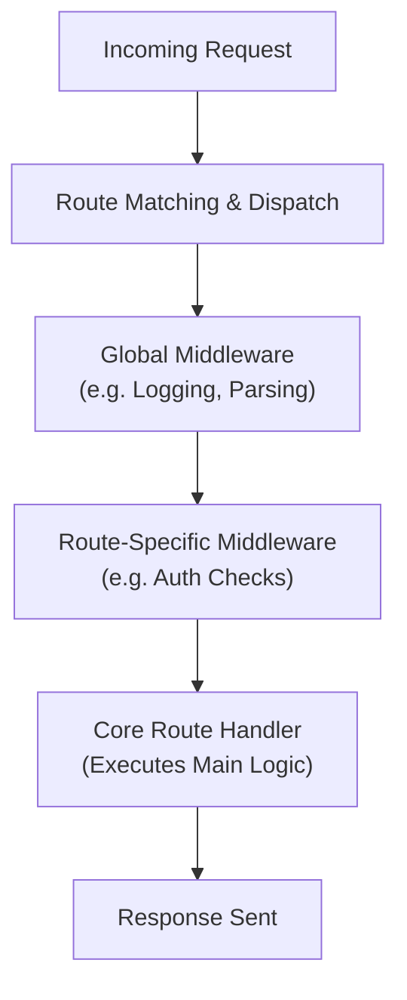

## Understanding API Routing & Middleware Basics in Uwazi

When you're working with Uwazi, a big part of what makes everything run smoothly is how incoming API requests are handled. This page dives into the core mechanics behind that process—showing you how Uwazi organizes its routes and middleware to process, modify, and respond to requests effectively. Whether you’re building new features or troubleshooting, knowing this request flow is essential to mastering Uwazi’s backend behavior.

### What API Routing and Middleware Mean for You

At its simplest, routing decides *where* each request should go based on the URL and HTTP method, while middleware acts as a pipeline of functions that can check, modify, or enrich requests and responses along the way. The combination gives you fine control over how Uwazi handles everything from authentication to data management without mixing responsibilities.

This section is aimed at developers, integrators, and power users who want to understand the backbone of request handling in Uwazi. It sets the stage for customizing or extending behavior, and it’s a key stepping stone before diving into finer details like authentication or individual API endpoints.

### How Routing and Middleware Work Together in Uwazi

When a request reaches Uwazi, the routing system quickly matches the request path and method against predefined routes. Each matched route then passes the request through a series of middleware functions before reaching the core handler that executes the business logic. Middleware can run globally or be scoped to particular routes — meaning certain checks or preprocessing steps happen every time or only for specific endpoints.

Here’s the general flow:



You can think of middleware as gatekeepers and helpers: some check that the user is allowed to perform an action, others transform data formats, and some add headers or handle errors gracefully before the response goes back.

### Seeing Routing & Middleware in Action

Imagine you’re building a custom Uwazi extension that needs to verify a user’s token on certain API calls. Middleware lets you insert that verification step cleanly — before the core functionality even begins — so you avoid duplicated code across multiple endpoints.

For example, a route might look like this in the codebase:

```javascript
app.use('/api/documents', verifyTokenMiddleware, documentsHandler);
```

Here, any request to `/api/documents` first passes through `verifyTokenMiddleware`, which can reject unauthorized calls or attach user info to the request object for downstream use.

This separation keeps your core business logic focused and pure, while middleware handles cross-cutting concerns like security and data transformation.

### Practical Tips for Working with Routing and Middleware

- **Order matters:** Middleware is executed in the order it’s added. Global middleware typically comes first, then route-specific ones.
- **Keep middleware focused:** Each middleware should have a clear, single responsibility—makes debugging easier.
- **Handle errors early:** Middleware can catch and respond to errors before they reach core handlers.
- **Test routes individually:** Use tools like Postman or curl to confirm both middleware and core logic perform as expected.
- **Extend cautiously:** Since middleware affects the request lifecycle globally or per route, unintended side effects can happen if the flow is disrupted.

### Where to Go from Here

Feeling ready to dive deeper? Check out the [Authentication & Authorization](/overview/core_concepts/authentication_overview) page to see how middleware is used for user security. When you want to understand the actual endpoints, head over to the [Core API Endpoints](/api_reference/core_apis/document_management_apis) section.

If you’re new to Uwazi, pairing this knowledge with the [Installation & Initial Configuration](/getting-started/uwazi-setup-essentials/installation-initial-configuration) guide will help you set everything up correctly.

<Source url="https://github.com/huridocs/uwazi" branch="main" paths={[{"path": "app/api/api.ts", "range": "10-60"},{"path": "app/api/middleware.ts", "range": "5-50"}]} />