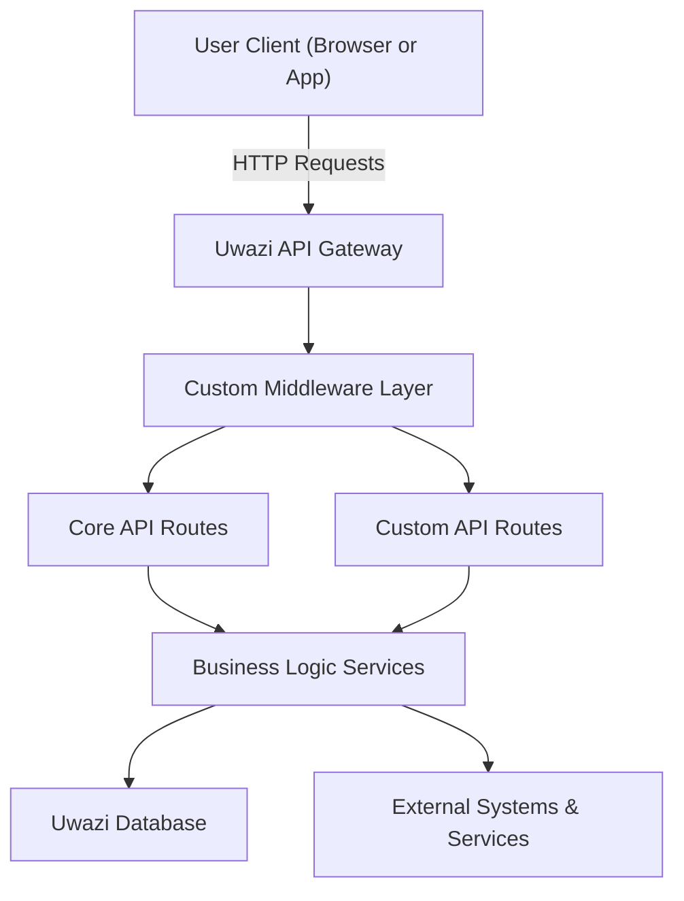

## Connecting Uwazi with External Systems and Services

Extending Uwazi to work smoothly alongside other tools is key when you want to tailor it exactly to your project's needs. This page helps you understand where Uwazi naturally connects with outside systems, which areas you can modify or extend easily, and how to introduce custom logic in the most effective way. Whether you're adding API routes, integrating middleware, or hooking Uwazi into your organization's workflow, this overview highlights the right touchpoints for your customizations.

## What Integrations & Extensibility Mean in Uwazi

At its core, Uwazi is designed to be adaptable. Integrations refer to how Uwazi can communicate and exchange data with other platforms or services, such as external authentication providers or analytics tools. Extensibility refers to the flexibility Uwazi gives you to customize or add new functionality without rewriting the core.

This page is primarily for developers or system integrators who want to build on top of Uwazi—for example, to plug in custom API routes, insert middleware for special request handling, or expand how Uwazi processes data. It’s the go-to place to understand the main extension points and how to work with them cleanly.

## The Core Extension Flow in Uwazi

Uwazi is built on a modular architecture that separates core features from custom code layers. Here's the high-level flow of how integrations slot in:

- **Middleware Layer:** Incoming requests can be intercepted or augmented with custom middleware—perfect for adding logging, security checks, or data transformations.
- **API Routes:** Uwazi exposes RESTful APIs that cover its core capabilities, but you can add new routes if you need special endpoints or to interact with external systems in specific ways.
- **Service Hooks:** Underneath the API layer, Uwazi’s services manage business logic. You can extend or override parts of this logic to accommodate unique workflows.



This flow allows you to introduce custom logic without touching the core code—keeping your integrations clean and easier to maintain.

<Source url="https://github.com/huridocs/uwazi" branch="main" paths={[{"path": "app/api/customMiddleware.js", "range": "1-60"},{"path": "app/api/routes/customRoutes.js", "range": "10-45"}]} />

## Real-World Extensibility Scenarios

Imagine you want Uwazi to authenticate users against your organization's Single Sign-On (SSO) system instead of the default login. You’d implement middleware that processes authentication tokens before requests reach the main API routes. This avoids changing core authentication code and keeps updates straightforward.

Or say you have a custom analytics service tracking document access in real time. You can add a new API endpoint that your frontend calls whenever a user opens a document, then relay those events out to the analytics service.

Here’s a brief example snippet showing how to define a new API route alongside Uwazi’s existing ones:

```javascript
// customRoutes.js
const express = require('express');
const router = express.Router();

router.get('/custom-status', (req, res) => {
  res.json({ status: 'Uwazi is up and custom route is working!' });
});

module.exports = router;
```

Then, this router is plugged into the middleware stack, allowing your route to respond as part of Uwazi’s overall API.

Quick note: When adding middleware or routes, make sure they are ordered correctly so they don't inadvertently block core functionalities or APIs.

## Tips for Seamless Integrations

- Start small: Add middleware or routes incrementally.
- Keep custom code in separate files/directories to simplify maintenance.
- Verify your routes and middleware don't conflict with existing ones.
- Use logging in middleware to debug the request flow.
- Always secure your custom endpoints—don’t bypass authentication accidentally.

<Note>
If you plan to share your Uwazi instance publicly, carefully review custom middleware for security implications, especially anything that intercepts authentication or data.
</Note>

## Get Up and Running

Once you know the key integration points, look at the [API Routing & Middleware Basics](/overview/core_concepts/api_and_middleware_basics) page for concrete instructions on setting up middleware and routes in Uwazi’s codebase. From there, you might also want to explore the [Authentication & Authorization](/overview/core_concepts/authentication_overview) documentation if you’re extending login flows.

Ready to dive in? Head over to the [Getting Started](/getting-started/uwazi-setup-essentials/prerequisites-system-requirements) section to set up your development environment and test your integrations smoothly.
